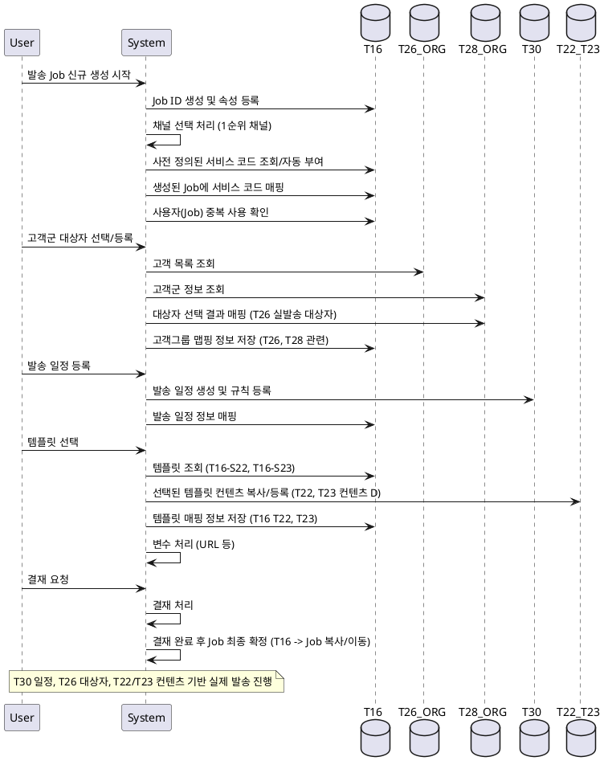

```plantuml
@startuml
participant User
participant System
database T16
database T26_ORG
database T28_ORG
database T30
database T22_T23

User -> System: 발송 Job 신규 생성 시작
System -> T16: Job ID 생성 및 속성 등록
System -> System: 채널 선택 처리 (1순위 채널)
System -> T16: 사전 정의된 서비스 코드 조회/자동 부여
System -> T16: 생성된 Job에 서비스 코드 매핑
System -> T16: 사용자(Job) 중복 사용 확인

User -> System: 고객군 대상자 선택/등록
System -> T26_ORG: 고객 목록 조회
System -> T28_ORG: 고객군 정보 조회
System -> T28_ORG: 대상자 선택 결과 매핑 (T26 실발송 대상자)
System -> T16: 고객그룹 맵핑 정보 저장 (T26, T28 관련)

User -> System: 발송 일정 등록
System -> T30: 발송 일정 생성 및 규칙 등록
System -> T16: 발송 일정 정보 매핑

User -> System: 템플릿 선택
System -> T16: 템플릿 조회 (T16-S22, T16-S23)
System -> T22_T23: 선택된 템플릿 컨텐츠 복사/등록 (T22, T23 컨텐츠 D)
System -> T16: 템플릿 매핑 정보 저장 (T16 T22, T23)
System -> System: 변수 처리 (URL 등)

User -> System: 결재 요청
System -> System: 결재 처리
System -> System: 결재 완료 후 Job 최종 확정 (T16 -> Job 복사/이동)

note over System: T30 일정, T26 대상자, T22/T23 컨텐츠 기반 실제 발송 진행

@enduml
```