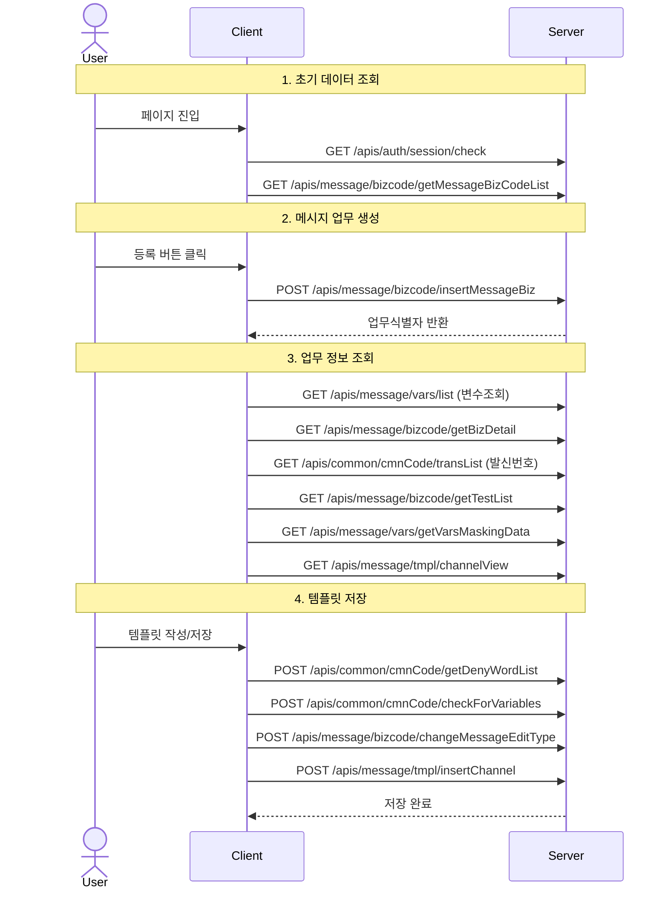

## 인증(session)체크
### EndPoint: /apis/auth/session/check
### REQ
```json
{
  "referer": "/msg/bizcode"
}
```

### RES
```json
{
    "status": 200,
    "code": "00",
    "msg": "",
    "results": {
        "직원번호": "24W0030",
        "부점코드": "0961",
        "부점명": "디지털플랫폼부",
        "본부구분코드": "1",
        "직원명": "제승한",
        "직원전화번호": "028041290",
        "휴대폰번호": "01093288264",
        "이메일주소": "sh.park@odinue.net",
        "직급코드": "10",
        "직급명": "",
        "역할식별자": "92000",
        "역할개수": "6",
        "역할식별자목록": "90001,90005,90006,90014,91000,92000",
        "권한개수": "17",
        "권한식별자목록": "AUTH_APPR_BAN_SEND,AUTH_APPR_BUDGET,AUTH_APPR_BULK_SEND,AUTH_APPR_COMPLY,AUTH_APPR_WORK,AUTH_DEPT_HQ,AUTH_DEPT_IT,AUTH_DETAIL_CUST,AUTH_MGT_DEBT,AUTH_MGT_OPER,AUTH_MGT_PRIVACY,AUTH_MGT_SETTLE,AUTH_MGT_SUPER,AUTH_MGT_UNREG_CUST,AUTH_REG_BAN_RCS,AUTH_REG_MARKET_MSG,AUTH_REG_WORK",
        "권한명목록": "발송제한고객승인권한,예산승인권한,발송일괄승인권한,준법승인권한,업무승인권한,본부부서,IT부서,고객별발송이력상세권한,여신사후관리권한,운영관리권한,개인정보취급권한,정산관리권한,슈퍼유저,미등록고객발송권한,RCS수신거부등록권한,마케팅메시지등록권한,업무등록권한",
        "메뉴이용자그룹식별자": "60000",
        "메뉴이용자그룹식별자목록": "10000,20000,41000,42000,50000,60000",
        "비밀번호변경일시": "20241205151209",
        "모부점코드": "",
        "자식부점여부": "N",
        "권한배열": [
            "AUTH_APPR_BAN_SEND",
            "AUTH_APPR_BUDGET",
            "AUTH_APPR_BULK_SEND",
            "AUTH_APPR_COMPLY",
            "AUTH_APPR_WORK",
            "AUTH_DEPT_HQ",
            "AUTH_DEPT_IT",
            "AUTH_DETAIL_CUST",
            "AUTH_MGT_DEBT",
            "AUTH_MGT_OPER",
            "AUTH_MGT_PRIVACY",
            "AUTH_MGT_SETTLE",
            "AUTH_MGT_SUPER",
            "AUTH_MGT_UNREG_CUST",
            "AUTH_REG_BAN_RCS",
            "AUTH_REG_MARKET_MSG",
            "AUTH_REG_WORK"
        ],
        "메뉴이용자그룹배열": [
            "10000",
            "20000",
            "41000",
            "42000",
            "50000",
            "60000"
        ]
    }
}
```


## 메세지 업무 목록 조회 
### EndPoint: /apis/message/bizcode/getMessageBizCodeList
### Req
```json
{
  "referer": "/msg/bizcode",
  "page": 1,
  "limit": 20,
  "searchDayType": "등록기간",
  "searchStartDay": "20200101",
  "searchEndDay": "20250108",
  "orderById": "",
  "orderByType": "",
  "지원채널": "",
  "등록직원번호": "24W0030",
  "등록직원명": "제승한",
  "메시지내용": "",
  "전체보기": "N"
}
```

### Res
```
{
    "status": 200,
    "code": "00",
    "msg": "",
    "results": [
        {
            "업무식별자": "W99_COM_00B6",
            "업무명": "테발",
            "요청시스템구분": "W",
            "요청시스템구분명": "사용자발송",
            "요청업무구분": "COM",
            "요청업무구분명": "공통",
            "발송목적": "99",
            "발송목적명": "[정보성] 기타",
            "업무사용범위": "1",
            "업무사용범위명": "등록부점",
            "정보광고구분": "0",
            "정보광고구분명": "정보성",
            "다채널전략내용": "SR",
            "심의종료일자": null,
            "처리상태구분": "00",
            "처리상태구분명": "임시저장",
            "활성여부": "Y",
            "활성여부명": "활성",
            "관리부점코드": "0961",
            "관리부점명": "디지털플랫폼부",
            "요청직원번호": "24W0030",
            "관리직원명": "제승한",
            "등록부점코드": "0961",
            "등록부점명": "디지털플랫폼부",
            "등록직원번호": "24W0030",
            "등록직원명": "제승한",
            "요청직원명": "제승한",
            "등록일시": "20241217173741",
            "메시지구분": "SR",
            "메시지구분유형내용": "SR",
            "최근발송일시": null,
            "업무템플릿일련번호": "34496",
            "변경버전갯수": "0",
            "승인구분코드": "S",
            "승인일련번호": "16227698",
            "승인항목코드": "B",
            "승인항목코드명": "업무승인",
            "승인연계식별자": "34496",
            "RNUM": "1"
        },
        {
            "업무식별자": "W07_DEP_0007",
            "업무명": "시연이세스트CELL-2",
            "요청시스템구분": "W",
            "요청시스템구분명": "사용자발송",
            "요청업무구분": "DEP",
            "요청업무구분명": "수신",
            "발송목적": "07",
            "발송목적명": "[정보성] 직원용(내부발송)",
            "업무사용범위": "1",
            "업무사용범위명": "등록부점",
            "정보광고구분": "0",
            "정보광고구분명": "정보성",
            "다채널전략내용": "TR,FM,LM",
            "심의종료일자": null,
            "처리상태구분": "10",
            "처리상태구분명": "개시완료",
            "활성여부": "Y",
            "활성여부명": "활성",
            "관리부점코드": "0961",
            "관리부점명": "디지털플랫폼부",
            "요청직원번호": "24W0030",
            "관리직원명": "제승한",
            "등록부점코드": "0961",
            "등록부점명": "디지털플랫폼부",
            "등록직원번호": "24W0030",
            "등록직원명": "제승한",
            "요청직원명": "제승한",
            "등록일시": "20241213161414",
            "메시지구분": "TR",
            "메시지구분유형내용": "TR,FM,LM",
            "최근발송일시": null,
            "업무템플릿일련번호": "34343",
            "변경버전갯수": "1",
            "승인구분코드": "R",
            "승인일련번호": "16227696",
            "승인항목코드": "B",
            "승인항목코드명": "업무승인",
            "승인연계식별자": "34343",
            "RNUM": "2"
        },
        {
            "업무식별자": "W01_COM_008H",
            "업무명": "s",
            "요청시스템구분": "W",
            "요청시스템구분명": "사용자발송",
            "요청업무구분": "COM",
            "요청업무구분명": "공통",
            "발송목적": "01",
            "발송목적명": "[광고성] 은행마케팅",
            "업무사용범위": "1",
            "업무사용범위명": "등록부점",
            "정보광고구분": "1",
            "정보광고구분명": "광고성",
            "다채널전략내용": "PM,FM,MR",
            "심의종료일자": null,
            "처리상태구분": "01",
            "처리상태구분명": "승인요청",
            "활성여부": "Y",
            "활성여부명": "활성",
            "관리부점코드": "0961",
            "관리부점명": "디지털플랫폼부",
            "요청직원번호": "24W0030",
            "관리직원명": "제승한",
            "등록부점코드": "0961",
            "등록부점명": "디지털플랫폼부",
            "등록직원번호": "24W0030",
            "등록직원명": "제승한",
            "요청직원명": "제승한",
            "등록일시": "20241125154150",
            "메시지구분": "PM",
            "메시지구분유형내용": "PM,FM,MR",
            "최근발송일시": null,
            "업무템플릿일련번호": "34092",
            "변경버전갯수": "0",
            "승인구분코드": "L",
            "승인일련번호": "16227655",
            "승인항목코드": "B",
            "승인항목코드명": "업무승인",
            "승인연계식별자": "34092",
            "RNUM": "3"
        },
        {
            "업무식별자": "W01_COM_008G",
            "업무명": "sSSS",
            "요청시스템구분": "W",
            "요청시스템구분명": "사용자발송",
            "요청업무구분": "COM",
            "요청업무구분명": "공통",
            "발송목적": "01",
            "발송목적명": "[광고성] 은행마케팅",
            "업무사용범위": "1",
            "업무사용범위명": "등록부점",
            "정보광고구분": "1",
            "정보광고구분명": "광고성",
            "다채널전략내용": "FM,MR,LM",
            "심의종료일자": null,
            "처리상태구분": "01",
            "처리상태구분명": "승인요청",
            "활성여부": "Y",
            "활성여부명": "활성",
            "관리부점코드": "0961",
            "관리부점명": "디지털플랫폼부",
            "요청직원번호": "24W0030",
            "관리직원명": "제승한",
            "등록부점코드": "0961",
            "등록부점명": "디지털플랫폼부",
            "등록직원번호": "24W0030",
            "등록직원명": "제승한",
            "요청직원명": "제승한",
            "등록일시": "20241122142501",
            "메시지구분": "FM",
            "메시지구분유형내용": "FM,MR,LM",
            "최근발송일시": null,
            "업무템플릿일련번호": "33899",
            "변경버전갯수": "0",
            "승인구분코드": "L",
            "승인일련번호": "16227641",
            "승인항목코드": "B",
            "승인항목코드명": "업무승인",
            "승인연계식별자": "33899",
            "RNUM": "4"
        },
        {
            "업무식별자": "W05_COM_0027",
            "업무명": "[11-15] 대출연체안내",
            "요청시스템구분": "W",
            "요청시스템구분명": "사용자발송",
            "요청업무구분": "COM",
            "요청업무구분명": "공통",
            "발송목적": "05",
            "발송목적명": "[정보성] 연체관리(대출,카드)",
            "업무사용범위": "1",
            "업무사용범위명": "등록부점",
            "정보광고구분": "0",
            "정보광고구분명": "정보성",
            "다채널전략내용": "PM,LR,LM",
            "심의종료일자": null,
            "처리상태구분": "00",
            "처리상태구분명": "임시저장",
            "활성여부": "Y",
            "활성여부명": "활성",
            "관리부점코드": "0961",
            "관리부점명": "디지털플랫폼부",
            "요청직원번호": "24W0030",
            "관리직원명": "제승한",
            "등록부점코드": "0961",
            "등록부점명": "디지털플랫폼부",
            "등록직원번호": "24W0030",
            "등록직원명": "제승한",
            "요청직원명": "제승한",
            "등록일시": "20241115043318",
            "메시지구분": "PM",
            "메시지구분유형내용": "LM,LR,PM",
            "최근발송일시": null,
            "업무템플릿일련번호": "33696",
            "변경버전갯수": "0",
            "승인구분코드": "K",
            "승인일련번호": "16227658",
            "승인항목코드": "B",
            "승인항목코드명": "업무승인",
            "승인연계식별자": "33696",
            "RNUM": "5"
        },
        {
            "업무식별자": "W07_COM_0014",
            "업무명": "0812 정보 테스트",
            "요청시스템구분": "W",
            "요청시스템구분명": "사용자발송",
            "요청업무구분": "COM",
            "요청업무구분명": "공통",
            "발송목적": "07",
            "발송목적명": "[정보성] 직원용(내부발송)",
            "업무사용범위": "1",
            "업무사용범위명": "등록부점",
            "정보광고구분": "0",
            "정보광고구분명": "정보성",
            "다채널전략내용": "PM,TR,KM,LM",
            "심의종료일자": null,
            "처리상태구분": "00",
            "처리상태구분명": "임시저장",
            "활성여부": "Y",
            "활성여부명": "활성",
            "관리부점코드": "0961",
            "관리부점명": "디지털플랫폼부",
            "요청직원번호": "24W0030",
            "관리직원명": "제승한",
            "등록부점코드": "0961",
            "등록부점명": "디지털플랫폼부",
            "등록직원번호": "24W0030",
            "등록직원명": "제승한",
            "요청직원명": "제승한",
            "등록일시": "20241113144302",
            "메시지구분": "PM",
            "메시지구분유형내용": "PM,TR,KM,LM",
            "최근발송일시": null,
            "업무템플릿일련번호": "33546",
            "변경버전갯수": "0",
            "승인구분코드": "H",
            "승인일련번호": "16227644",
            "승인항목코드": "B",
            "승인항목코드명": "업무승인",
            "승인연계식별자": "33546",
            "RNUM": "6"
        },
        {
            "업무식별자": "W05_COM_0026",
            "업무명": "ㅁㄴㅇㄻㄴㅇㄻㄴㅇㄹㄴㅇㄹ",
            "요청시스템구분": "W",
            "요청시스템구분명": "사용자발송",
            "요청업무구분": "COM",
            "요청업무구분명": "공통",
            "발송목적": "05",
            "발송목적명": "[정보성] 연체관리(대출,카드)",
            "업무사용범위": "1",
            "업무사용범위명": "등록부점",
            "정보광고구분": "0",
            "정보광고구분명": "정보성",
            "다채널전략내용": "KM,LR,LM",
            "심의종료일자": null,
            "처리상태구분": "01",
            "처리상태구분명": "승인요청",
            "활성여부": "Y",
            "활성여부명": "활성",
            "관리부점코드": "0961",
            "관리부점명": "디지털플랫폼부",
            "요청직원번호": "24W0030",
            "관리직원명": "제승한",
            "등록부점코드": "0961",
            "등록부점명": "디지털플랫폼부",
            "등록직원번호": "24W0030",
            "등록직원명": "제승한",
            "요청직원명": "제승한",
            "등록일시": "20241112180336",
            "메시지구분": "KM",
            "메시지구분유형내용": "KM,LR,LM",
            "최근발송일시": null,
            "업무템플릿일련번호": "33535",
            "변경버전갯수": "0",
            "승인구분코드": "K",
            "승인일련번호": "16227664",
            "승인항목코드": "B",
            "승인항목코드명": "업무승인",
            "승인연계식별자": "33535",
            "RNUM": "7"
        },
        {
            "업무식별자": "W05_COM_0025",
            "업무명": "회수 테스트 입니다.",
            "요청시스템구분": "W",
            "요청시스템구분명": "사용자발송",
            "요청업무구분": "COM",
            "요청업무구분명": "공통",
            "발송목적": "05",
            "발송목적명": "[정보성] 연체관리(대출,카드)",
            "업무사용범위": "1",
            "업무사용범위명": "등록부점",
            "정보광고구분": "0",
            "정보광고구분명": "정보성",
            "다채널전략내용": "KM,LM",
            "심의종료일자": null,
            "처리상태구분": "00",
            "처리상태구분명": "임시저장",
            "활성여부": "Y",
            "활성여부명": "활성",
            "관리부점코드": "0961",
            "관리부점명": "디지털플랫폼부",
            "요청직원번호": "24W0030",
            "관리직원명": "제승한",
            "등록부점코드": "0961",
            "등록부점명": "디지털플랫폼부",
            "등록직원번호": "24W0030",
            "등록직원명": "제승한",
            "요청직원명": "제승한",
            "등록일시": "20241112180336",
            "메시지구분": "KM",
            "메시지구분유형내용": "KM,LM,TR",
            "최근발송일시": null,
            "업무템플릿일련번호": "33529",
            "변경버전갯수": "0",
            "승인구분코드": "S",
            "승인일련번호": "16227606",
            "승인항목코드": "B",
            "승인항목코드명": "업무승인",
            "승인연계식별자": "33529",
            "RNUM": "8"
        },
        {
            "업무식별자": "S51_DEP_000E",
            "업무명": "rcscell_2",
            "요청시스템구분": "W",
            "요청시스템구분명": "사용자발송",
            "요청업무구분": "COM",
            "요청업무구분명": "공통",
            "발송목적": "01",
            "발송목적명": "[광고성] 은행마케팅",
            "업무사용범위": "1",
            "업무사용범위명": "등록부점",
            "정보광고구분": "1",
            "정보광고구분명": "광고성",
            "다채널전략내용": "TR,LM",
            "심의종료일자": null,
            "처리상태구분": "10",
            "처리상태구분명": "개시완료",
            "활성여부": "Y",
            "활성여부명": "활성",
            "관리부점코드": "0961",
            "관리부점명": "디지털플랫폼부",
            "요청직원번호": "24W0030",
            "관리직원명": "제승한",
            "등록부점코드": "0961",
            "등록부점명": "디지털플랫폼부",
            "등록직원번호": "24W0030",
            "등록직원명": "제승한",
            "요청직원명": "제승한",
            "등록일시": "20241112131325",
            "메시지구분": "TR",
            "메시지구분유형내용": "TR,LM",
            "최근발송일시": null,
            "업무템플릿일련번호": "33507",
            "변경버전갯수": "0",
            "승인구분코드": "S",
            "승인일련번호": "16227593",
            "승인항목코드": "B",
            "승인항목코드명": "업무승인",
            "승인연계식별자": "33507",
            "RNUM": "9"
        },
        {
            "업무식별자": "W01_COM_008F",
            "업무명": "sSSS",
            "요청시스템구분": "W",
            "요청시스템구분명": "사용자발송",
            "요청업무구분": "COM",
            "요청업무구분명": "공통",
            "발송목적": "01",
            "발송목적명": "[광고성] 은행마케팅",
            "업무사용범위": "1",
            "업무사용범위명": "등록부점",
            "정보광고구분": "1",
            "정보광고구분명": "광고성",
            "다채널전략내용": "TR",
            "심의종료일자": null,
            "처리상태구분": "10",
            "처리상태구분명": "개시완료",
            "활성여부": "Y",
            "활성여부명": "활성",
            "관리부점코드": "0961",
            "관리부점명": "디지털플랫폼부",
            "요청직원번호": "24W0030",
            "관리직원명": "제승한",
            "등록부점코드": "0961",
            "등록부점명": "디지털플랫폼부",
            "등록직원번호": "24W0030",
            "등록직원명": "제승한",
            "요청직원명": "제승한",
            "등록일시": "20241112131059",
            "메시지구분": "TR",
            "메시지구분유형내용": "TR",
            "최근발송일시": null,
            "업무템플릿일련번호": "33505",
            "변경버전갯수": "0",
            "승인구분코드": "R",
            "승인일련번호": "16227588",
            "승인항목코드": "B",
            "승인항목코드명": "업무승인",
            "승인연계식별자": "33505",
            "RNUM": "10"
        },
        {
            "업무식별자": "W04_COM_00AC",
            "업무명": "RCS MMS 테스트",
            "요청시스템구분": "W",
            "요청시스템구분명": "사용자발송",
            "요청업무구분": "COM",
            "요청업무구분명": "공통",
            "발송목적": "04",
            "발송목적명": "[정보성] 기존계약유지(유지관리)",
            "업무사용범위": "1",
            "업무사용범위명": "등록부점",
            "정보광고구분": "0",
            "정보광고구분명": "정보성",
            "다채널전략내용": "MR",
            "심의종료일자": null,
            "처리상태구분": "10",
            "처리상태구분명": "개시완료",
            "활성여부": "Y",
            "활성여부명": "활성",
            "관리부점코드": "0961",
            "관리부점명": "디지털플랫폼부",
            "요청직원번호": "24W0030",
            "관리직원명": "제승한",
            "등록부점코드": "0961",
            "등록부점명": "디지털플랫폼부",
            "등록직원번호": "24W0030",
            "등록직원명": "제승한",
            "요청직원명": "제승한",
            "등록일시": "20241110194825",
            "메시지구분": "MR",
            "메시지구분유형내용": "MR",
            "최근발송일시": null,
            "업무템플릿일련번호": "33492",
            "변경버전갯수": "0",
            "승인구분코드": "S",
            "승인일련번호": "16227537",
            "승인항목코드": "B",
            "승인항목코드명": "업무승인",
            "승인연계식별자": "33492",
            "RNUM": "11"
        },
        {
            "업무식별자": "W99_COM_00B4",
            "업무명": "테스트",
            "요청시스템구분": "W",
            "요청시스템구분명": "사용자발송",
            "요청업무구분": "COM",
            "요청업무구분명": "공통",
            "발송목적": "99",
            "발송목적명": "[정보성] 기타",
            "업무사용범위": "1",
            "업무사용범위명": "등록부점",
            "정보광고구분": "0",
            "정보광고구분명": "정보성",
            "다채널전략내용": "PM,TR",
            "심의종료일자": null,
            "처리상태구분": "01",
            "처리상태구분명": "승인요청",
            "활성여부": "Y",
            "활성여부명": "활성",
            "관리부점코드": "0961",
            "관리부점명": "디지털플랫폼부",
            "요청직원번호": "24W0030",
            "관리직원명": "제승한",
            "등록부점코드": "0961",
            "등록부점명": "디지털플랫폼부",
            "등록직원번호": "24W0030",
            "등록직원명": "제승한",
            "요청직원명": "제승한",
            "등록일시": "20241107172314",
            "메시지구분": "PM",
            "메시지구분유형내용": "PM,TR",
            "최근발송일시": null,
            "업무템플릿일련번호": "33322",
            "변경버전갯수": "0",
            "승인구분코드": "F",
            "승인일련번호": "16227594",
            "승인항목코드": "B",
            "승인항목코드명": "업무승인",
            "승인연계식별자": "33322",
            "RNUM": "12"
        },
        {
            "업무식별자": "W05_COM_0024",
            "업무명": "하하하",
            "요청시스템구분": "W",
            "요청시스템구분명": "사용자발송",
            "요청업무구분": "COM",
            "요청업무구분명": "공통",
            "발송목적": "05",
            "발송목적명": "[정보성] 연체관리(대출,카드)",
            "업무사용범위": "1",
            "업무사용범위명": "등록부점",
            "정보광고구분": "0",
            "정보광고구분명": "정보성",
            "다채널전략내용": "LM",
            "심의종료일자": null,
            "처리상태구분": "00",
            "처리상태구분명": "임시저장",
            "활성여부": "Y",
            "활성여부명": "활성",
            "관리부점코드": "0961",
            "관리부점명": "디지털플랫폼부",
            "요청직원번호": "24W0030",
            "관리직원명": "제승한",
            "등록부점코드": "0961",
            "등록부점명": "디지털플랫폼부",
            "등록직원번호": "24W0030",
            "등록직원명": "제승한",
            "요청직원명": "제승한",
            "등록일시": "20241107163122",
            "메시지구분": "LM",
            "메시지구분유형내용": "LM,TR",
            "최근발송일시": null,
            "업무템플릿일련번호": "33527",
            "변경버전갯수": "0",
            "승인구분코드": null,
            "승인일련번호": null,
            "승인항목코드": null,
            "승인항목코드명": null,
            "승인연계식별자": null,
            "RNUM": "13"
        },
        {
            "업무식별자": "W05_COM_0023",
            "업무명": "ㄴㅇ뫄ㅓㄴㅇㄹ",
            "요청시스템구분": "W",
            "요청시스템구분명": "사용자발송",
            "요청업무구분": "COM",
            "요청업무구분명": "공통",
            "발송목적": "05",
            "발송목적명": "[정보성] 연체관리(대출,카드)",
            "업무사용범위": "1",
            "업무사용범위명": "등록부점",
            "정보광고구분": "0",
            "정보광고구분명": "정보성",
            "다채널전략내용": "LM",
            "심의종료일자": null,
            "처리상태구분": "01",
            "처리상태구분명": "승인요청",
            "활성여부": "Y",
            "활성여부명": "활성",
            "관리부점코드": "0961",
            "관리부점명": "디지털플랫폼부",
            "요청직원번호": "24W0030",
            "관리직원명": "제승한",
            "등록부점코드": "0961",
            "등록부점명": "디지털플랫폼부",
            "등록직원번호": "24W0030",
            "등록직원명": "제승한",
            "요청직원명": "제승한",
            "등록일시": "20241107163027",
            "메시지구분": "LM",
            "메시지구분유형내용": "LM",
            "최근발송일시": null,
            "업무템플릿일련번호": "33318",
            "변경버전갯수": "0",
            "승인구분코드": "H",
            "승인일련번호": "16227520",
            "승인항목코드": "B",
            "승인항목코드명": "업무승인",
            "승인연계식별자": "33318",
            "RNUM": "14"
        },
        {
            "업무식별자": "W01_COM_008D",
            "업무명": "s",
            "요청시스템구분": "W",
            "요청시스템구분명": "사용자발송",
            "요청업무구분": "COM",
            "요청업무구분명": "공통",
            "발송목적": "01",
            "발송목적명": "[광고성] 은행마케팅",
            "업무사용범위": "1",
            "업무사용범위명": "등록부점",
            "정보광고구분": "1",
            "정보광고구분명": "광고성",
            "다채널전략내용": "LM",
            "심의종료일자": null,
            "처리상태구분": "01",
            "처리상태구분명": "승인요청",
            "활성여부": "Y",
            "활성여부명": "활성",
            "관리부점코드": "0961",
            "관리부점명": "디지털플랫폼부",
            "요청직원번호": "24W0030",
            "관리직원명": "제승한",
            "등록부점코드": "0961",
            "등록부점명": "디지털플랫폼부",
            "등록직원번호": "24W0030",
            "등록직원명": "제승한",
            "요청직원명": "제승한",
            "등록일시": "20241107104843",
            "메시지구분": "LM",
            "메시지구분유형내용": "LM",
            "최근발송일시": null,
            "업무템플릿일련번호": "33315",
            "변경버전갯수": "0",
            "승인구분코드": "L",
            "승인일련번호": "16227598",
            "승인항목코드": "B",
            "승인항목코드명": "업무승인",
            "승인연계식별자": "33315",
            "RNUM": "15"
        },
        {
            "업무식별자": "W99_COM_00B3",
            "업무명": "20241106 테스트",
            "요청시스템구분": "W",
            "요청시스템구분명": "사용자발송",
            "요청업무구분": "COM",
            "요청업무구분명": "공통",
            "발송목적": "99",
            "발송목적명": "[정보성] 기타",
            "업무사용범위": "1",
            "업무사용범위명": "등록부점",
            "정보광고구분": "0",
            "정보광고구분명": "정보성",
            "다채널전략내용": "TR",
            "심의종료일자": null,
            "처리상태구분": "00",
            "처리상태구분명": "임시저장",
            "활성여부": "Y",
            "활성여부명": "활성",
            "관리부점코드": "0961",
            "관리부점명": "디지털플랫폼부",
            "요청직원번호": "24W0030",
            "관리직원명": "제승한",
            "등록부점코드": "0961",
            "등록부점명": "디지털플랫폼부",
            "등록직원번호": "24W0030",
            "등록직원명": "제승한",
            "요청직원명": "제승한",
            "등록일시": "20241106111425",
            "메시지구분": "TR",
            "메시지구분유형내용": "TR",
            "최근발송일시": null,
            "업무템플릿일련번호": "33309",
            "변경버전갯수": "1",
            "승인구분코드": "H",
            "승인일련번호": "16227511",
            "승인항목코드": "B",
            "승인항목코드명": "업무승인",
            "승인연계식별자": "33309",
            "RNUM": "16"
        },
        {
            "업무식별자": "W05_COM_0022",
            "업무명": "[테스트] 채권식별번호 조립-1028-01",
            "요청시스템구분": "W",
            "요청시스템구분명": "사용자발송",
            "요청업무구분": "COM",
            "요청업무구분명": "공통",
            "발송목적": "05",
            "발송목적명": "[정보성] 연체관리(대출,카드)",
            "업무사용범위": "1",
            "업무사용범위명": "등록부점",
            "정보광고구분": "0",
            "정보광고구분명": "정보성",
            "다채널전략내용": "LR,LM",
            "심의종료일자": null,
            "처리상태구분": "10",
            "처리상태구분명": "개시완료",
            "활성여부": "Y",
            "활성여부명": "활성",
            "관리부점코드": "0961",
            "관리부점명": "디지털플랫폼부",
            "요청직원번호": "24W0030",
            "관리직원명": "제승한",
            "등록부점코드": "0961",
            "등록부점명": "디지털플랫폼부",
            "등록직원번호": "24W0030",
            "등록직원명": "제승한",
            "요청직원명": "제승한",
            "등록일시": "20241028175957",
            "메시지구분": "LR",
            "메시지구분유형내용": "LR,LM",
            "최근발송일시": "20241028181017",
            "업무템플릿일련번호": "33107",
            "변경버전갯수": "0",
            "승인구분코드": "S",
            "승인일련번호": "16227473",
            "승인항목코드": "B",
            "승인항목코드명": "업무승인",
            "승인연계식별자": "33107",
            "RNUM": "17"
        },
        {
            "업무식별자": "W06_COM_000O000001",
            "업무명": "[테스트] 업무코드길이초과_1028-01",
            "요청시스템구분": "W",
            "요청시스템구분명": "사용자발송",
            "요청업무구분": "COM",
            "요청업무구분명": "공통",
            "발송목적": "06",
            "발송목적명": "[정보성] 법령 및 업무 안내통지",
            "업무사용범위": "1",
            "업무사용범위명": "등록부점",
            "정보광고구분": "0",
            "정보광고구분명": "정보성",
            "다채널전략내용": "KM",
            "심의종료일자": null,
            "처리상태구분": "01",
            "처리상태구분명": "승인요청",
            "활성여부": "Y",
            "활성여부명": "활성",
            "관리부점코드": "0961",
            "관리부점명": "디지털플랫폼부",
            "요청직원번호": "24W0030",
            "관리직원명": "제승한",
            "등록부점코드": "0961",
            "등록부점명": "디지털플랫폼부",
            "등록직원번호": "24W0030",
            "등록직원명": "제승한",
            "요청직원명": "제승한",
            "등록일시": "20241028114328",
            "메시지구분": "KM",
            "메시지구분유형내용": "KM",
            "최근발송일시": null,
            "업무템플릿일련번호": "33093",
            "변경버전갯수": "0",
            "승인구분코드": "K",
            "승인일련번호": "16227466",
            "승인항목코드": "B",
            "승인항목코드명": "업무승인",
            "승인연계식별자": "33093",
            "RNUM": "18"
        },
        {
            "업무식별자": "W99_COM_00B2",
            "업무명": "sms단텍",
            "요청시스템구분": "W",
            "요청시스템구분명": "사용자발송",
            "요청업무구분": "COM",
            "요청업무구분명": "공통",
            "발송목적": "99",
            "발송목적명": "[정보성] 기타",
            "업무사용범위": "1",
            "업무사용범위명": "등록부점",
            "정보광고구분": "0",
            "정보광고구분명": "정보성",
            "다채널전략내용": "SM",
            "심의종료일자": null,
            "처리상태구분": "01",
            "처리상태구분명": "승인요청",
            "활성여부": "Y",
            "활성여부명": "활성",
            "관리부점코드": "0961",
            "관리부점명": "디지털플랫폼부",
            "요청직원번호": "24W0030",
            "관리직원명": "제승한",
            "등록부점코드": "0961",
            "등록부점명": "디지털플랫폼부",
            "등록직원번호": "24W0030",
            "등록직원명": "제승한",
            "요청직원명": "제승한",
            "등록일시": "20241018105802",
            "메시지구분": "SM",
            "메시지구분유형내용": "SM",
            "최근발송일시": null,
            "업무템플릿일련번호": "32820",
            "변경버전갯수": "0",
            "승인구분코드": "H",
            "승인일련번호": "16227403",
            "승인항목코드": "B",
            "승인항목코드명": "업무승인",
            "승인연계식별자": "32820",
            "RNUM": "19"
        },
        {
            "업무식별자": "W99_COM_00B1",
            "업무명": "썸넬2장",
            "요청시스템구분": "W",
            "요청시스템구분명": "사용자발송",
            "요청업무구분": "COM",
            "요청업무구분명": "공통",
            "발송목적": "99",
            "발송목적명": "[정보성] 기타",
            "업무사용범위": "1",
            "업무사용범위명": "등록부점",
            "정보광고구분": "0",
            "정보광고구분명": "정보성",
            "다채널전략내용": "IR",
            "심의종료일자": null,
            "처리상태구분": "04",
            "처리상태구분명": "반려",
            "활성여부": "Y",
            "활성여부명": "활성",
            "관리부점코드": "0961",
            "관리부점명": "디지털플랫폼부",
            "요청직원번호": "24W0030",
            "관리직원명": "제승한",
            "등록부점코드": "0961",
            "등록부점명": "디지털플랫폼부",
            "등록직원번호": "24W0030",
            "등록직원명": "제승한",
            "요청직원명": "제승한",
            "등록일시": "20241004162921",
            "메시지구분": "IR",
            "메시지구분유형내용": "IR",
            "최근발송일시": null,
            "업무템플릿일련번호": "32721",
            "변경버전갯수": "0",
            "승인구분코드": "H",
            "승인일련번호": "16227334",
            "승인항목코드": "B",
            "승인항목코드명": "업무승인",
            "승인연계식별자": "32721",
            "RNUM": "20"
        }
    ],
    "totalCount": 60
}
```


### Controller
```jsp
<#case "getMessageBizCodeList">  
    <#--    
메시지 업무 목록 조회  
        payload = {            limit: 20            page: 1            referer: "/msg/bizcode"            searchDayType: "등록일/심의만료일"  
            searchEndDay: "20240331"            searchStartDay: "20220701"            searchType: "메시지업무명/메시지업무코드"  
            searchWord: ""            지원채널: ""  
            요청시스템구분: ""  
            발송목적: ""  
            요청업무구분: ""  
            등록직원번호: ""  
            메시지내용: ""  
            처리상태구분: ""  
            활성여부: ""  
            버전: ""  
        }    -->    <#assign apiData = doSvc("message", "svcBizcode", "getMessageBizCodeList") />  
<#break />
```
### Service
```jsp
<#--  
    함수명 : getMessageBizCodeList    함수설명 : 메시지 업무 목록 조회  
    파리미터 :    리턴 :-->  
<#function getMessageBizCodeList>  
  <#local returnData = m1.editable({  
    "status" : 200,  
    "code" : "00",  
    "msg" : "",  
    "results" : []  
  }) />  
  <#if JSON.searchWord?has_content>  
      <#local r = JSON.put("bizcdSearchWord", JSON.searchWord?trim) />  
  </#if>  
  <#local r = m1.print("@@@@@ getMessageBizCodeList JSON Data @@@@@", JSON) />  
  
  <#local result = getMessageBizCodeListImpl(JSON) />  
  
  <#local r = returnData.merge(result) />  
  
    <#return returnData />  
</#function>
```
### DAO(SQL)
```jsp
<#-- 메시지업무목록(TSDMSU16) 조회 --><#function getMessageBizCodeListImpl reqData>  
    <#local query>  
        SELECT T16.업무식별자,  
            T16.업무명,  
            T16.요청시스템구분,  
            (SELECT 화면표시명 FROM TSDMSU46 WHERE 공통코드 = '요청시스템구분' AND 인스턴스내용 = T16.요청시스템구분 AND 활성여부 = 'Y' AND ROWNUM = 1) as 요청시스템구분명,  
            T16.요청업무구분,  
            (SELECT 화면표시명 FROM TSDMSU46 WHERE 공통코드 = '요청업무구분' AND 인스턴스내용 = T16.요청업무구분 AND 활성여부 = 'Y' AND ROWNUM = 1) as 요청업무구분명,  
            T16.발송목적,  
            (SELECT 화면표시명 FROM TSDMSU46 WHERE 공통코드 = '발송목적구분' AND 인스턴스내용 = T16.발송목적 AND 활성여부 = 'Y' AND ROWNUM = 1) as 발송목적명,  
            T16.업무사용범위,  
            (SELECT 화면표시명 FROM TSDMSU46 WHERE 공통코드 = '업무사용범위' AND 인스턴스내용 = T16.업무사용범위 AND 활성여부 = 'Y' AND ROWNUM = 1) as 업무사용범위명,  
            T16.정보광고구분,  
            (SELECT 화면표시명 FROM TSDMSU46 WHERE 공통코드 = '정보광고구분' AND 인스턴스내용 = T16.정보광고구분 AND 활성여부 = 'Y' AND ROWNUM = 1) as 정보광고구분명,  
            T16.다채널전략내용,  
            <#-- DECODE(T16.심의정보사용구분, 'L', T16.심의종료일자, null) as 심의종료일자,-->  
            S23.심의종료일자,  
            T16.처리상태구분,  
            (SELECT 화면표시명 FROM TSDMSU46 WHERE 공통코드 = '처리상태구분' AND 인스턴스내용 = T16.처리상태구분 AND 활성여부 = 'Y' AND ROWNUM = 1) as 처리상태구분명,  
            T16.활성여부,  
            (SELECT 화면표시명 FROM TSDMSU46 WHERE 공통코드 = '활성여부' AND 인스턴스내용 = T16.활성여부 AND 활성여부 = 'Y' AND ROWNUM = 1) as 활성여부명,  
            T16.요청부점코드 as 관리부점코드,  
            T11_2.부점명 as 관리부점명,  
            T16.요청직원번호,  
            T12_2.직원명 as 관리직원명,  
            T16.등록부점코드,  
            T11_3.부점명 as 등록부점명,  
            T16.등록직원번호,  
            T12.직원명 as 등록직원명,  
            T12.직원명 AS 요청직원명,  
            T16.등록일시,  
            T16.메시지구분,  
            S22.메시지구분유형내용,  
            T16.최근발송일시,  
            S22.업무템플릿일련번호,  
            (SELECT COUNT(1) as CNT FROM TSDMSU16 WHERE 그룹회사코드 = T16.그룹회사코드 AND 업무식별자 = T16.업무식별자 AND 버전번호 = '0') as 변경버전갯수,  
            (  
                    SELECT 승인구분코드 FROM (  
                        SELECT 승인구분코드, 승인상태코드 FROM TSDMSU25 WHERE 그룹회사코드 = T16.그룹회사코드 AND 업무식별자 = T16.업무식별자 AND 승인연계식별자 = S22.업무템플릿일련번호 AND 승인항목코드 = 'B' ORDER BY DECODE(승인상태코드, 'W',1, 'Y',2, 'N',3, 'I',4, 4) DESC, DECODE(승인상태코드, 'W', 10 - 승인순위, 승인순위) DESC  
                    ) SUB25 WHERE ROWNUM = 1  
            ) as 승인구분코드,  
            T25.승인일련번호,  
            T25.승인항목코드,  
            (  
                SELECT 화면표시명  
                FROM TSDMSU46  
                WHERE  
                    그룹회사코드 = '${M1_GROUP_CO_CD}'  
                    AND 공통코드 = '승인항목코드'  
                    AND 인스턴스내용 = T25.승인항목코드  
                    AND 활성여부 = 'Y'  
            ) AS 승인항목코드명,  
            T25.승인연계식별자  
        FROM TSDMSU16 T16  
            LEFT JOIN TSDMSU11 T11_2 ON (T11_2.그룹회사코드 = T16.그룹회사코드 AND T11_2.부점코드 = T16.요청부점코드 AND T11_2.버전번호 = '1')  
            LEFT JOIN TSDMSU11 T11_3 ON (T11_3.그룹회사코드 = T16.그룹회사코드 AND T11_3.부점코드 = T16.등록부점코드 AND T11_3.버전번호 = '1')  
            LEFT JOIN TSDMSU12 T12 ON (T12.그룹회사코드 = T16.그룹회사코드 AND T16.등록직원번호 = T12.직원번호 AND T12.버전번호 = '1')  
            LEFT JOIN TSDMSU12 T12_2 ON (T12_2.그룹회사코드 = T16.그룹회사코드 AND T16.요청직원번호 = T12_2.직원번호 AND T12_2.버전번호 = '1')  
            LEFT JOIN TSDMSU16_S22 S22 ON (S22.그룹회사코드 = T16.그룹회사코드 AND S22.업무식별자 = T16.업무식별자 AND T16.버전번호 = S22.버전번호)  
            LEFT JOIN TSDMSU16_S23 S23 ON (S23.그룹회사코드 = T16.그룹회사코드 AND S23.업무식별자 = S22.업무식별자 AND S23.업무템플릿일련번호 = S22.업무템플릿일련번호 and S23.메시지구분 = NVL(T16.메시지구분, NVL(SUBSTR(S22.다채널전략내용,1,2), SUBSTR(T16.다채널전략내용,1,2))))  
            LEFT JOIN (SELECT 그룹회사코드, 업무식별자, 승인구분코드, 승인상태코드, 승인일련번호, 승인항목코드, 승인연계식별자,  
                            ROW_NUMBER() OVER (PARTITION BY 그룹회사코드, 업무식별자, 승인연계식별자 ORDER BY 승인일련번호) as rn  
                        FROM TSDMSU25) T25 ON (T25.그룹회사코드 = T16.그룹회사코드 AND T25.업무식별자 = T16.업무식별자 AND S22.업무템플릿일련번호 = T25.승인연계식별자 AND T25.rn = 1)  
        WHERE T16.그룹회사코드 = '${M1_GROUP_CO_CD}'  
            AND T16.처리상태구분 NOT IN ( '-9' )  
        <#if reqData["searchDayType"]?has_content && reqData["searchStartDay"]?has_content && reqData["searchEndDay"]?has_content>  
            <#if (reqData["searchDayType"]?matches("등록기간")?size > 0)>  
                AND SUBSTR(T16.등록일시, 0, 8) BETWEEN @searchStartDay AND @searchEndDay  
            <#elseif (reqData["searchDayType"]?matches("심의기간")?size > 0)>  
                AND SUBSTR(T16.심의종료일자, 0, 8) BETWEEN @searchStartDay AND @searchEndDay  
            </#if>  
        </#if>        <#if reqData["searchType"]?has_content && reqData["searchWord"]?has_content>  
            <#if (reqData["searchType"]?matches("업무명")?size > 0)>  
                AND T16.업무명 LIKE '%'|| @searchWord ||'%'   
            <#elseif (reqData["searchType"]?matches("업무식별자")?size > 0)>  
                AND T16.업무식별자 LIKE '%'|| @bizcdSearchWord ||'%'  
            </#if>  
        <#elseif !(reqData["searchType"]?has_content) && reqData["searchWord"]?has_content>  
            AND (T16.업무명 LIKE '%'|| @searchWord ||'%' OR T16.업무식별자 LIKE '%'|| @bizcdSearchWord ||'%')  
        </#if>  
        <#if reqData["발송목적"]?has_content>  
            AND T16.발송목적 = @발송목적  
        </#if>  
        <#if reqData["업무구분"]?has_content>  
            AND T16.요청업무구분 = @업무구분  
        </#if>  
        <#if reqData["활성여부"]?has_content>  
            AND T16.활성여부 = @활성여부  
        </#if>  
        <#if reqData["등록직원번호"]?has_content>  
            AND T16.등록직원번호 LIKE '%'|| @등록직원번호 ||'%'  
        </#if>  
        <#if reqData["메시지내용"]?has_content || reqData["지원채널"]?has_content>  
            AND S22.업무템플릿일련번호 IN (  
                SELECT 업무템플릿일련번호  
                FROM TSDMSU16_S23  
                WHERE 그룹회사코드 = T16.그룹회사코드 AND 업무식별자 = T16.업무식별자 AND 업무템플릿일련번호 = S22.업무템플릿일련번호  
                <#if reqData["메시지내용"]?has_content>  
                    AND 메시지내용 LIKE '%'|| @메시지내용 ||'%'  
                </#if>  
                <#if reqData["지원채널"]?has_content>  
                    AND 메시지구분 IN ('${reqData["지원채널"]?join("', '")}')  
                </#if>  
            )  
        </#if>  
        <#-- 업무등록권한이 없는 영업점과 고객센터는 웹만 조회가능 (2024-07-10, 2024-09-23) -->        <#if !authCheck("AUTH_REG_WORK") && authCheck(["AUTH_DEPT_SALES","AUTH_DEPT_CUST"])>  
            <#if reqData.전체보기?? && reqData.전체보기 == 'Y'>  
                AND (T16.요청시스템구분 IN ('W','B','C') OR T16.업무사용범위 = '2')  
            <#else>  
                AND T16.요청시스템구분 = 'W'  
                AND (T16.업무사용범위 = '2' OR T16.요청부점코드 = '${SESS_INFO.부점코드}')  
            </#if>  
            AND T16.처리상태구분 = '10'  
            AND T16.버전번호 = '1'  
        <#elseif authCheck(["AUTH_MGT_HELPDESK","AUTH_MGT_OPER","AUTH_MGT_SUPER"]) >  
            <#-- IT/운영관리자는 모든 업무 조회/관리가능 (2024-07-10) -->            AND T16.버전번호 = NVL(@버전, 1)  
            <#if reqData["요청시스템구분"]?has_content>  
                AND T16.요청시스템구분 = @요청시스템구분  
            </#if>  
            <#if reqData["처리상태구분"]?has_content>  
                AND T16.처리상태구분 = @처리상태구분  
            </#if>  
        <#else>            <#-- 본부부서는 전부점 + 본인부서만 조회가능 (2024-07-10) -->            AND (  
                T16.요청부점코드 = '${SESS_INFO.부점코드}' OR T16.등록부점코드 = '${SESS_INFO.부점코드}'  
                OR ( T16.업무사용범위 = '2' AND T16.처리상태구분 = '10' AND T16.버전번호 = 1 )  
                <#if reqData.전체보기?? && reqData.전체보기 == 'Y'>  
                    OR ( T16.요청시스템구분 IN ('B', 'C') AND T16.처리상태구분 = '10' AND T16.버전번호 = 1 )  
                </#if>  
            )  
            <#if reqData["요청시스템구분"]?has_content>  
                AND T16.요청시스템구분 = @요청시스템구분  
            </#if>  
            <#if reqData["처리상태구분"]?has_content>  
                AND T16.처리상태구분 = @처리상태구분  
            </#if>  
            AND T16.버전번호 = NVL(@버전, 1)  
        </#if>  
        <#if reqData["orderById"]?? && reqData["orderById"] != "" && (reqData["orderByType"] == "ASC" || reqData["orderByType"] == "DESC")>  
            <#if reqData["orderById"] == "요청시스템구분명">  
                ORDER BY 요청시스템구분명 ${reqData["orderByType"]!"DESC"}  
            <#elseif reqData["orderById"] == "발송목적명">  
                ORDER BY 발송목적명 ${reqData["orderByType"]!"DESC"}  
            <#elseif reqData["orderById"] == "요청업무구분명">  
                ORDER BY 요청업무구분명 ${reqData["orderByType"]!"DESC"}  
            <#elseif reqData["orderById"] == "등록직원명">  
                ORDER BY T12.직원명 ${reqData["orderByType"]!"DESC"}  
            <#else>                ORDER BY T16.${reqData["orderById"]} ${reqData["orderByType"]}  
            </#if>        <#else>            ORDER BY NVL(T16.등록일시,'1') DESC, T16.업무명, T16.업무식별자  
        </#if>  
    </#local>  
    <#return pagingQuery(query, reqData) />  
</#function>
```
## 메세지 업무 상세: 
### EndPoint: /apis/message/bizcode/getBizDetail
### REQ
```json
{
  "referer": "/msg/bizcode/edit/W99_COM_00B6",
  "업무식별자": "W99_COM_00B6",
  "버전번호": ""
}
```

### RES
```json
{
    "status": 200,
    "code": "00",
    "msg": "",
    "results": {
        "업무상세": {
            "업무식별자": "W99_COM_00B6",
            "버전번호": "1",
            "활성여부": "Y",
            "처리상태구분": "00",
            "처리상태구분명": "임시저장",
            "업무명": "테발",
            "요청업무구분": "COM",
            "요청업무구분명": "공통",
            "요청시스템구분": "W",
            "업무대분류명": "사용자발송",
            "정보광고구분": "0",
            "정보광고구분명": "정보성",
            "발송목적": "99",
            "발송목적명": "[정보성] 기타",
            "업무사용범위": "1",
            "업무사용범위명": "등록부점",
            "거래코드": "KJBWEB1",
            "거래코드명": "UMS 웹, 기타(재전송,테스트) 발송",
            "통지여부": null,
            "RIMS공유여부": "N",
            "통지구분코드": "00",
            "통지구분인터페이스ID": null,
            "발송승인여부": null,
            "고객수수료과금여부": null,
            "고객수수료면제여부": null,
            "유효서비스시구간여부": "Y",
            "유효서비스시구간내용": "00~24",
            "마케팅동의구분": "B",
            "필터링유형내용": "[\"I\",\"G\"]",
            "발신번호대상구분": "1",
            "발신처전화번호": "15776825",
            "테스트여부": "Y",
            "요청부점코드": "0961",
            "요청부점명": "디지털플랫폼부",
            "요청직원번호": "24W0030",
            "요청직원명": "제승한",
            "등록부점코드": "0961",
            "등록부점명": "디지털플랫폼부",
            "등록직원번호": "24W0030",
            "등록직원명": "제승한",
            "등록일시": "20241217173741",
            "치환변수추가목록": "[{\"#채권식별번호\":\"\"}]",
            "설명내용": null,
            "수정내용": null,
            "메시지구분": "SR",
            "푸시앱식별자": null,
            "발송수": null,
            "심의상태구분": null,
            "대외승인상태구분": null,
            "최근발송일시": null,
            "유량제어대상여부": null,
            "메시지구분유형내용": "SR",
            "업무템플릿일련번호": "34496",
            "승인일련번호": "16227698",
            "승인순위": "1",
            "승인항목코드": "B",
            "테스트발송대상내용": "0610054",
            "메시지편집여부": "N",
            "메시지편집유형": "N",
            "다채널전략구분": "A",
            "다채널전략내용": "SR",
            "머리말내용": null,
            "꼬리말내용": null,
            "추가입력변수내용": null,
            "업무회사코드": "B",
            "업무회사코드명": "은행",
            "예약개시여부": null,
            "예약개시일시": null,
            "최상위승인직원번호": "0610054",
            "최상위승인직원명": "선종달"
        },
        "업무분류상세": {
            "메시지업무코드": "W99_COM",
            "메시지업무명": null,
            "업무사용범위": null,
            "요청부점코드": null,
            "요청부점명": null,
            "요청직원번호": null,
            "요청직원명": null,
            "업무대분류": "W",
            "정보광고구분": "0",
            "업무대분류명": "사용자발송",
            "발송목적": "99",
            "발송목적명": "[정보성] 기타",
            "업무구분": "COM",
            "업무구분명": "공통",
            "등록부점코드": "0961",
            "등록부점명": "디지털플랫폼부",
            "등록직원번호": "1710303",
            "등록직원명": "제태현",
            "발송허용시간": "00~24",
            "발송허용여부": "Y",
            "마케팅동의구분": null,
            "필터링유형내용": "[\"I\",\"G\"]",
            "필터링유형잠금내용": "[\"F\",\"H\",\"I\",\"G\"]",
            "발송모듈구분코드": "KJBWEB1",
            "RIMS공유여부": null,
            "발송승인여부": null,
            "수수료징수구분": null,
            "고객접촉정보관리동기화": null,
            "통지구분코드": null,
            "통지구분인터페이스ID": null,
            "업무회사코드": null,
            "발신번호대상구분": "1",
            "발신처전화번호": "16004000",
            "통지여부": null
        },
        "업무승인목록": [
            {
                "승인일련번호": "16227698",
                "승인항목코드": "B",
                "승인구분코드": "S",
                "승인연계식별자": "34496",
                "업무식별자": "W99_COM_00B6",
                "승인순위": "1",
                "승인상태코드": "T",
                "승인상태코드명": "임시저장",
                "승인직원번호": "24W0030",
                "승인직원명": "제승한",
                "승인부점코드": "0961",
                "승인부점명": "디지털플랫폼부",
                "승인일시": null,
                "사유내용": null,
                "요청직원번호": "24W0030",
                "요청직원명": "제승한",
                "요청일시": "20241217173842"
            }
        ],
        "템플릿목록": [
            {
                "메시지구분": "SR",
                "메시지구분명": "RCS SMS",
                "메시지제목": null,
                "메시지내용": "1598",
                "첨부파일들": null,
                "활성여부": "Y",
                "채널별브랜드ID": "BR.5a641o624E",
                "채널별템플릿ID": "SS000000",
                "채널별전문내용": "{\"brandId\":\"BR.5a641o624E\",\"expiryOption\":\"2\",\"header\":\"0\",\"footer\":\"\",\"copyAllowed\":\"1\",\"serviceType\":\"SS000000\",\"extraTitle\":[],\"extraDescription\":[],\"vButton\":{}}",
                "템플릿분류": "SR",
                "푸시앱식별자": null,
                "푸시알림함구분": null,
                "푸시파일경로명": null,
                "채널별버튼내용": "[{\"suggestions\":[]}]",
                "버튼사용여부": null,
                "템플릿유형": "SR",
                "템플릿속성": "SS000000",
                "채널별옵션내용": null,
                "푸시알림함구분명": null,
                "알림톡카테고리그룹": "SS0",
                "알림톡카테고리그룹명": null,
                "템플릿분류명": null,
                "채널별브랜드명": "어다인",
                "승인상태변경일시": null,
                "처리상태구분": null,
                "처리상태구분명": null,
                "반려사유내용": null,
                "업무템플릿일련번호": "34496",
                "업무식별자": "W99_COM_00B6",
                "업무채널템플릿일련번호": "34497",
                "금지어여부": "N",
                "금지어내용": null,
                "단일텍스트입력여부": "N",
                "단일텍스트입력부내용": null,
                "심의정보사용구분": null,
                "심의번호": null,
                "심의일자": null,
                "심의종료일자": null,
                "심의반려사유": null,
                "심의정보JSON": null
            }
        ],
        "버전목록": [
            {
                "업무식별자": "W99_COM_00B6",
                "버전번호": "1",
                "처리상태구분": "00",
                "처리상태구분명": "임시저장"
            }
        ]
    }
}
```

## 메세지 업무 등록(등록 버튼 클릭 시 호출됨)
### EndPoint: /apis/message/bizcode/insertMessageBiz
[[메세지 업무(채널) 생성 API]]
### REQ
```json
{
  "referer": "/msg/bizcode",
  "업무분류식별자": "W04_COM",
  "요청시스템구분": "W",
  "발송목적": "04",
  "요청업무구분": "COM",
  "정보광고구분": "0",
  "업무회사코드": "B",
  "수동지정업무식별자": "",
  "수동지정업무생성여부": "N"
}
```
### RES
```json
{"status":200,"code":"00","msg":"","results":[],"업무식별자":"W04_COM_00AD"}
```

## 업무 정보 조회 단계

### 변수 조회: /apis/message/vars/list
신규 생성된 채널의 변수 조회
#### REQ
```json
{
  "referer": "/msg/bizcode/edit/W04_COM_00AD",
  "변수구분": "W",
  "limit": -9
}
```
#### RES
```json
{
    "status": 200,
    "code": "00",
    "msg": "",
    "results": [
        {
            "변수일련번호": "17096183",
            "변수구분": "W",
            "변수구분명": "사용자변수",
            "변수명": "eventURL",
            "변수내용": "https:\/\/www.odinue.net\/mweb\/main\/utils\/News\/",
            "변수설명": "어다인은행 이벤트페이지",
            "지원채널": "PM,SR,KM,LR,FM,MR,SM,TR,LM,MM,IR",
            "직원번호": "24W0030",
            "직원명": "제승한",
            "등록일시": "20241114185618",
            "활성여부": "Y",
            "마스킹구분코드": null,
            "활성여부명": "활성",
            "RNUM": "1"
        }
    ],
    "totalCount": 145
}
```

/apis/common/cmn-code/list


### 변수 조회2: /apis/message/vars/list
신규 생성된 채널의 변수 조회2
#### REQ
```json
{
  "referer": "/msg/bizcode/edit/W04_COM_00AD",
  "변수구분": "2",
  "limit": -9
}
```

### 메세지 업무 상세 조회
#### EndPoint: /apis/message/bizcode/getBizDetail
메세지 업무 등록 후 업무식별자로 템플릿일련번호는 조회 하기 위한 용도로 파악됨
#### REQ
```json
{
  "referer": "/msg/bizcode/edit/W04_COM_00AD",
  "업무식별자": "W04_COM_00AD",
  "버전번호": ""
}
```

#### RES
```json
{
    "status": 200,
    "code": "00",
    "msg": "", 
    "results": {
        "업무상세": {
            "업무식별자": "W04_COM_00AD",
            "버전번호": "1",
            "활성여부": "Y",
            "처리상태구분": "-9",
            "처리상태구분명": "가상생성",
            "업무명": "ㅋ",
            "요청업무구분": "COM",
            "요청업무구분명": "공통",
            "요청시스템구분": "W",
            "업무대분류명": "사용자발송",
            "정보광고구분": "0",
            "정보광고구분명": "정보성",
            "발송목적": "04",
            "발송목적명": "[정보성] 기존계약유지(유지관리)",
            "업무사용범위": "1",
            "업무사용범위명": "등록부점",
            "거래코드": "KJBWEB1",
            "거래코드명": "UMS 웹, 기타(재전송,테스트) 발송",
            "통지여부": "N",
            "RIMS공유여부": "N",
            "통지구분코드": null,
            "통지구분인터페이스ID": null,
            "발송승인여부": "N",
            "고객수수료과금여부": "N",
            "고객수수료면제여부": null,
            "유효서비스시구간여부": "Y",
            "유효서비스시구간내용": "00~24",
            "마케팅동의구분": "B",
            "필터링유형내용": "[\"I\"]",
            "발신번호대상구분": "1",
            "발신처전화번호": "16004000",
            "테스트여부": null,
            "요청부점코드": "0961",
            "요청부점명": "디지털플랫폼부",
            "요청직원번호": "24W0030",
            "요청직원명": "제승한",
            "등록부점코드": "0961",
            "등록부점명": "디지털플랫폼부",
            "등록직원번호": "24W0030",
            "등록직원명": "제승한",
            "등록일시": "20241219155844",
            "치환변수추가목록": null,
            "설명내용": null,
            "수정내용": null,
            "메시지구분": null,
            "푸시앱식별자": null,
            "발송수": null,
            "심의상태구분": null,
            "대외승인상태구분": null,
            "최근발송일시": null,
            "유량제어대상여부": null,
            "메시지구분유형내용": null,
            "업무템플릿일련번호": "34503",
            "승인일련번호": null,
            "승인순위": null,
            "승인항목코드": null,
            "테스트발송대상내용": null,
            "메시지편집여부": "N",
            "메시지편집유형": null,
            "다채널전략구분": null,
            "다채널전략내용": null,
            "머리말내용": null,
            "꼬리말내용": null,
            "추가입력변수내용": null,
            "업무회사코드": "B",
            "업무회사코드명": "은행",
            "예약개시여부": null,
            "예약개시일시": null,
            "최상위승인직원번호": "0610054",
            "최상위승인직원명": "선종달"
        },
        "업무분류상세": {
            "메시지업무코드": "W04_COM",
            "메시지업무명": "ㅋ",
            "업무사용범위": "1",
            "요청부점코드": null,
            "요청부점명": null,
            "요청직원번호": null,
            "요청직원명": null,
            "업무대분류": "W",
            "정보광고구분": "0",
            "업무대분류명": "사용자발송",
            "발송목적": "04",
            "발송목적명": "[정보성] 기존계약유지(유지관리)",
            "업무구분": "COM",
            "업무구분명": "공통",
            "등록부점코드": "0980",
            "등록부점명": "디지털개발부",
            "등록직원번호": "7140059",
            "등록직원명": "권다인",
            "발송허용시간": "00~24",
            "발송허용여부": "Y",
            "마케팅동의구분": null,
            "필터링유형내용": "[\"I\"]",
            "필터링유형잠금내용": "[\"F\",\"H\",\"I\",\"G\"]",
            "발송모듈구분코드": "KJBWEB1",
            "RIMS공유여부": "N",
            "발송승인여부": "N",
            "수수료징수구분": "N",
            "고객접촉정보관리동기화": "N",
            "통지구분코드": null,
            "통지구분인터페이스ID": null,
            "업무회사코드": null,
            "발신번호대상구분": "1",
            "발신처전화번호": "16004000",
            "통지여부": "N"
        },
        "업무승인목록": [],
        "템플릿목록": [],
        "버전목록": [
            {
                "업무식별자": "W04_COM_00AD",
                "버전번호": "1",
                "처리상태구분": "-9",
                "처리상태구분명": "가상생성"
            }
        ]
    }
}
```

### 발신번호 조회
#### EndPoint: /apis/common/cmnCode/transList

### 발송테스트 조회 
#### EndPoint: /apis/message/bizcode/getTestList
#### REQ
```json
{
  "referer": "/msg/bizcode/edit/W04_COM_00AD",
  "업무식별자": "W04_COM_00AD",
  "버전번호": "1",
  "업무템플릿일련번호": "34503",
  "테스트발송대상내용": null
}
```

### 변수마스킹?
#### EndPoint: /apis/message/vars/getVarsMaskingData
#### REQ
```json
{
  "referer": "/msg/bizcode/edit/W04_COM_00AD",
  "변수명목록": []
}
```

### 템플릿조회?: /apis/message/tmpl/channelView
#### REQ
```json
{
  "referer": "/msg/bizcode/edit/W04_COM_00AD",
  "템플릿일련번호": "34503",
  "메시지구분": "LM",
  "조회메뉴": "B",
  "업무식별자": "W04_COM_00AD"
}
```

## 템플릿 저장 전 체크
### 금칙어 검사: /apis/common/cmnCode/getDenyWordList
#### REQ
```json
{
  "referer": "/msg/bizcode/edit/W04_COM_00AD",
  "업무식별자": "W04_COM_00AD",
  "버전번호": "1",
  "msg": [
    "22222",
    "동해물과백 두산이 마르고 닳도록"
  ]
}
```

#### RES
```json
{
    "status": 200,
    "code": "00",
    "msg": "",
    "results": {
        "isForbiddenWords": false,
        "forbidWords": []
    }
}
```

### 변수체크: /cmnCode/checkForVariables
#### REQ
```json
{
  "referer": "/msg/bizcode/edit/W04_COM_00AD",
  "변수목록": []
}
```

### 메세지 수정 타입 변경?: /apis/message/bizcode/changeMessageEditType

#### REQ
```json
{
  "referer": "/msg/bizcode/edit/W04_COM_00AD",
  "업무식별자": "W04_COM_00AD",
  "버전번호": "1",
  "업무템플릿일련번호": "34503",
  "메시지편집여부": "N",
  "메시지편집유형": "N",
  "단일텍스트입력여부": "N"
}
```

## 템플릿 생성: /apis/message/tmpl/insertChannel
### REQ
```json
{
  "referer": "/msg/bizcode/edit/W04_COM_00AD",
  "saveDivCd": "one",
  "메시지구분": "LM",
  "메시지구분명": "LMS",
  "메시지제목": "22222",
  "메시지내용": "동해물과백 두산이 마르고 닳도록",
  "활성여부": "Y",
  "업무식별자": "W04_COM_00AD",
  "템플릿일련번호": "34503",
  "버전번호": "1",
  "다채널전략구분": "A",
  "다채널전략내용": "LM",
  "템플릿목록": "LM",
  "금지어정보": {
    "hasForbidden": false,
    "hasForbiddenYn": "N",
    "forbiddenWordList": [],
    "checkYn": true
  },
  "필터링유형내용": [
    "I"
  ]
}
```

[[메세지 업무(채널) 생성 API]]

