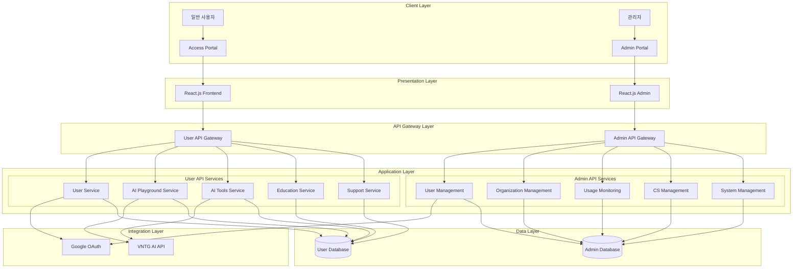

---
tags:
  - 제안
created: 2024-10-23 16:29
updated: 2024-10-23 17:57
---

----
## Index

- [1. 개요](#1.%20%EA%B0%9C%EC%9A%94)
	- [1.1 목적](#1.1%20%EB%AA%A9%EC%A0%81)
	- [1.2 범위](#1.2%20%EB%B2%94%EC%9C%84)
- [2. 시스템 아키텍처](#2.%20%EC%8B%9C%EC%8A%A4%ED%85%9C%20%EC%95%84%ED%82%A4%ED%85%8D%EC%B2%98)
	- [2.1 전체 아키텍처 구성도](#2.1%20%EC%A0%84%EC%B2%B4%20%EC%95%84%ED%82%A4%ED%85%8D%EC%B2%98%20%EA%B5%AC%EC%84%B1%EB%8F%84)
	- [2.2 계층별 설명](#2.2%20%EA%B3%84%EC%B8%B5%EB%B3%84%20%EC%84%A4%EB%AA%85)
		- [2.2.1 Client Layer](#2.2.1%20Client%20Layer)
		- [2.2.2 Presentation Layer](#2.2.2%20Presentation%20Layer)
		- [2.2.3 Application Layer](#2.2.3%20Application%20Layer)
		- [2.2.4 Integration Layer](#2.2.4%20Integration%20Layer)
		- [2.2.5 Data Layer](#2.2.5%20Data%20Layer)
- [3. 주요 기술 요구사항](#3.%20%EC%A3%BC%EC%9A%94%20%EA%B8%B0%EC%88%A0%20%EC%9A%94%EA%B5%AC%EC%82%AC%ED%95%AD)
	- [3.1 성능 요구사항](#3.1%20%EC%84%B1%EB%8A%A5%20%EC%9A%94%EA%B5%AC%EC%82%AC%ED%95%AD)
	- [3.2 보안 요구사항](#3.2%20%EB%B3%B4%EC%95%88%20%EC%9A%94%EA%B5%AC%EC%82%AC%ED%95%AD)
	- [3.3 확장성 요구사항](#3.3%20%ED%99%95%EC%9E%A5%EC%84%B1%20%EC%9A%94%EA%B5%AC%EC%82%AC%ED%95%AD)
- [4. 구현 전략](#4.%20%EA%B5%AC%ED%98%84%20%EC%A0%84%EB%9E%B5)
	- [4.1 Frontend 구현](#4.1%20Frontend%20%EA%B5%AC%ED%98%84)
	- [4.2 Backend 구현](#4.2%20Backend%20%EA%B5%AC%ED%98%84)
	- [4.3 데이터 관리](#4.3%20%EB%8D%B0%EC%9D%B4%ED%84%B0%20%EA%B4%80%EB%A6%AC)
- [5. 품질 보증 방안](#5.%20%ED%92%88%EC%A7%88%20%EB%B3%B4%EC%A6%9D%20%EB%B0%A9%EC%95%88)
	- [5.1 테스트 전략](#5.1%20%ED%85%8C%EC%8A%A4%ED%8A%B8%20%EC%A0%84%EB%9E%B5)
	- [5.2 모니터링 방안](#5.2%20%EB%AA%A8%EB%8B%88%ED%84%B0%EB%A7%81%20%EB%B0%A9%EC%95%88)
- [6. 배포 전략](#6.%20%EB%B0%B0%ED%8F%AC%20%EC%A0%84%EB%9E%B5)
	- [6.1 개발 환경](#6.1%20%EA%B0%9C%EB%B0%9C%20%ED%99%98%EA%B2%BD)
	- [6.2 배포 프로세스](#6.2%20%EB%B0%B0%ED%8F%AC%20%ED%94%84%EB%A1%9C%EC%84%B8%EC%8A%A4)
- [7. 운영 지원](#7.%20%EC%9A%B4%EC%98%81%20%EC%A7%80%EC%9B%90)
	- [7.1 장애 대응](#7.1%20%EC%9E%A5%EC%95%A0%20%EB%8C%80%EC%9D%91)
	- [7.2 유지보수](#7.2%20%EC%9C%A0%EC%A7%80%EB%B3%B4%EC%88%98)
- [8. 참고 사항](#8.%20%EC%B0%B8%EA%B3%A0%20%EC%82%AC%ED%95%AD)
	- [8.1 용어 정의](#8.1%20%EC%9A%A9%EC%96%B4%20%EC%A0%95%EC%9D%98)
	- [8.2 관련 문서](#8.2%20%EA%B4%80%EB%A0%A8%20%EB%AC%B8%EC%84%9C)

## 1. 개요

### 1.1 목적
본 문서는 기업용 Gen AI Platform의 시스템 아키텍처를 정의하고, 각 컴포넌트의 역할과 상호작용을 설명합니다.

### 1.2 범위
- Access Portal (F/O) 개발
- Admin Portal (B/O) 개발
- 외부 시스템 연동 (VNTG AI API, Google OAuth)

## 2. 시스템 아키텍처

### 2.1 전체 아키텍처 구성도

### 2.2 계층별 설명

#### 2.2.1 Client Layer
- **일반 사용자 (Access Portal)**
  - AI 서비스 접근 및 활용
  - AI 도구 생성 및 관리
  - 교육 콘텐츠 접근

- **관리자 (Admin Portal)**
  - 시스템 관리 기능 접근
  - 사용자/조직 관리
  - 모니터링 및 통계

#### 2.2.2 Presentation Layer
- **React.js Frontend**
  - SPA(Single Page Application) 구조
  - 반응형 웹 디자인
  - 컴포넌트 기반 아키텍처

- **주요 기술 스택**
  - React.js
  - Typescript
  - TailwindCSS
  - 상태관리: Redux/Context API

#### 2.2.3 Application Layer
- **Spring Boot REST API**
  - RESTful API 설계
  - JWT 기반 인증/인가
  - 마이크로서비스 아키텍처 지향

- **핵심 기능 모듈**
  1. User Management
     - 사용자 정보 관리
     - 권한 관리
     - OAuth 연동

  2. Organization Management
     - 조직 구조 관리
     - 팀 관리
     - 권한 체계 관리

  3. AI Playground
     - AI 모델 실행 환경
     - VNTG AI API 연동
     - 결과 스트리밍 처리

  4. AI Tools Management
     - 도구 생성/수정/삭제
     - 권한 관리
     - 버전 관리

  5. Educational Content
     - 콘텐츠 관리
     - 카테고리 관리
     - 접근 권한 관리

  6. Customer Support
     - 문의 관리
     - FAQ 관리
     - 공지사항 관리

  7. Usage Monitoring
     - 사용량 모니터링
     - 통계 데이터 생성
     - 리포트 생성

#### 2.2.4 Integration Layer
- **Google OAuth**
  - 사용자 인증
  - 프로필 정보 연동
  - 접근 토큰 관리

- **VNTG AI API**
  - AI 모델 호출
  - 응답 처리
  - 에러 핸들링

#### 2.2.5 Data Layer
- **PostgreSQL**
  - 사용자/조직 데이터
  - AI 도구 메타데이터
  - 시스템 운영 데이터

## 3. 주요 기술 요구사항

### 3.1 성능 요구사항
- 동시 사용자 500명 이상 처리
- API 응답시간 3초 이내
- 페이지 로딩 시간 2초 이내

### 3.2 보안 요구사항
- VNTG 모의해킹 테스트 통과
- OWASP 보안 가이드라인 준수
- 데이터 암호화 (전송 및 저장)

### 3.3 확장성 요구사항
- 모듈식 구조로 기능 확장 용이
- API 버전 관리
- 컴포넌트 재사용성 확보

## 4. 구현 전략

### 4.1 Frontend 구현
- 컴포넌트 기반 개발
- 상태 관리 전략 수립
- 반응형 디자인 적용
- 성능 최적화 (Code Splitting, Lazy Loading)

### 4.2 Backend 구현
- RESTful API 설계 원칙 준수
- 트랜잭션 관리
- 캐시 전략 수립
- 에러 핸들링 표준화

### 4.3 데이터 관리
- 데이터 모델링
- 인덱싱 전략
- 쿼리 최적화
- 데이터 백업 전략

## 5. 품질 보증 방안

### 5.1 테스트 전략
- 단위 테스트
- 통합 테스트
- E2E 테스트
- 성능 테스트

### 5.2 모니터링 방안
- 시스템 성능 모니터링
- 사용자 행동 분석
- 오류 로깅 및 추적
- 리소스 사용량 모니터링

## 6. 배포 전략

### 6.1 개발 환경
- 로컬 개발 환경
- 테스트 환경
- 스테이징 환경
- 운영 환경

### 6.2 배포 프로세스
- 코드 버전 관리
- CI/CD 파이프라인
- 무중단 배포 전략
- 롤백 절차

## 7. 운영 지원

### 7.1 장애 대응
- 장애 감지 및 알림
- 장애 대응 프로세스
- 장애 보고 체계

### 7.2 유지보수
- 정기 점검 계획
- 패치 및 업데이트 절차
- 기술 지원 체계

## 8. 참고 사항

### 8.1 용어 정의
- 시스템 관련 용어 정의
- 비즈니스 용어 정의

### 8.2 관련 문서
- API 문서
- 데이터베이스 설계서
- UI/UX 가이드라인