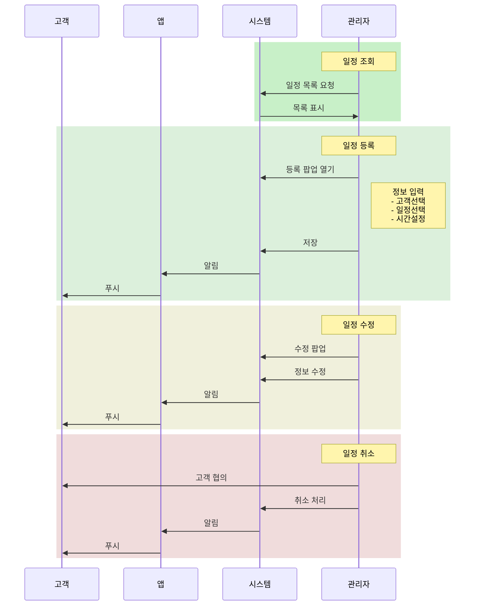

---
tags:
  - 메뉴얼
  - 헬시버디
  - 상담일정
created: 2024-11-17 12:10
modified: 2024-11-17 12:10
related: 
updated: 2024-11-17 18:57
---
# 메뉴 구조도
**관리자 사이트에는 1depth 메뉴는 보여 주고 있지 않습니다.**
![[Pasted image 20241117182517.png]]
# 1. 서비스 흐름도

## 2. 화면 구성

### 2.1 고객 상담 일정 목록 조회
![[Pasted image 20241117121543.png]]
### 2.2 고객 상담 일정 등록
![[Pasted image 20241117121637.png]]

### 2.3 고객 상담 일정 상세 조회 및 수정
![[Pasted image 20241117121620.png]]

## 3. 화면 개요

### 3.1 화면 정보
- **메뉴 경로**: 상담일정 > 고객 상담 일정
- **화면 설명**: 고객 상담 일정을 등록, 조회, 관리하는 화면

### 3.2 주요 기능
- 신규 상담 일정 등록
- 기존 상담 일정 조회/수정/삭제
- 고객 상세정보 페이지 이동
- 상담 이력 관리

## 4. 상세 기능 설명

### 4.1 고객 상담 일정 등록
1. '등록' 버튼 클릭
2. 등록 팝업에서 정보 입력
   - **고객이름**: 검색 후 선택
   - **상담 일정**: 드롭다운에서 선택
   - **종류**: 상담 유형 선택
   - **상담일**: 달력에서 날짜 선택
   - **시작시간/종료시간**: 시간 선택
   - **고객 참고내용**: 상담 관련 특이사항 입력
   - **고객 참고 Link**: 관련 URL 입력 (선택사항)
   - **변경이력**: 등록 사유 등 기록
3. '추가' 버튼으로 저장
4. 등록된 일정은 고객 앱으로 자동 알림

### 4.2 고객 상담 일정 조회
1. 검색 조건 설정
   - 업체명 선택
   - 종류 선택
2. '검색' 버튼 클릭
3. 오늘 날짜 이후 30일간 일정이 목록에 표시됨

### 4.3 고객 상담 일정 수정
1. **중요: 반드시 고객과 사전 협의 필요**
2. 수정할 일정의 '수정' 버튼 클릭
3. 수정 팝업에서 정보 변경
   - 시작/종료 시간
   - 상담 참고내용
   - 상담 참고 Link
   - 변경이력 (*입력 권장*)
4. '수정' 버튼으로 저장
5. 수정된 일정은 고객 앱에 자동 반영

### 4.4 고객 상담 일정 삭제
1. **중요: 반드시 고객과 사전 협의 필요**
2. 취소할 일정의 '삭제' 버튼 클릭
3. 취소 사유 입력
4. 확인 후 취소 처리
5. 취소 알림이 고객 앱으로 전송됨

# ⚠️ **중요 주의사항**

- 상담 시간은 최소 10분 에서 60분 까지 10 단위로 설정
- 고객 일정 등록은 업체 상담 일정과 독립적으로 관리 가능
- 고객 일정 수정 및 삭제는 반드시 고객과 협의 후 진행
- 수정/삭제 시 변경이력 상세히 기록
