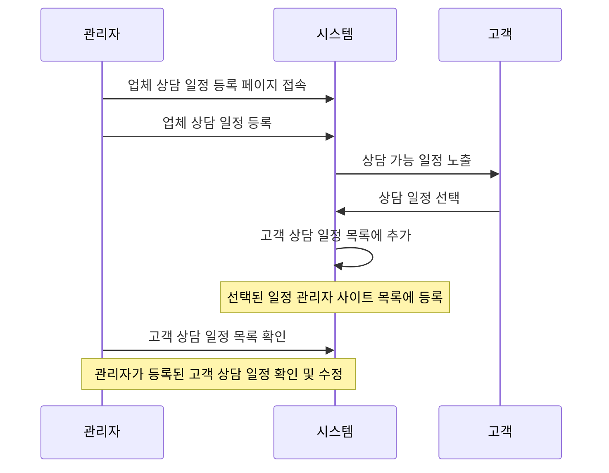

---
tags:
  - 헬시버디
  - 메뉴얼
created: 2024-11-17 10:47
modified: 2024-11-17 10:47
related: 
updated: 2024-11-17 18:59
---
# 메뉴 구조도
**관리자 사이트에는 1depth 메뉴는 보여 주고 있지 않습니다.**
![[Pasted image 20241117182600.png]]
# 1. 서비스 흐름도

# 2. 화면 구성도

## 2.1 업체 상담 일정 목록
![[Pasted image 20241117105651.png]]
## 2.2 업체 상담 일정 등록 및 수정 
![[Pasted image 20241117105732.png]]
## 2.3 업체 상담 일정 상세, 수정 , 삭제
![[Pasted image 20241117105719.png]]

# 3. 개요

## 3.1 메뉴 위치

- 경로: 상담일정 > 업체 상담 일정
- 접근 권한: 관리자

## 3.2 주요 기능

- 업체별 상담 일정 등록/수정/삭제
- 상담 가능 시간 및 담당 버디 관리
- 상담 예약 현황 조회
- 상담 일정 CSV 다운로드

# 3. 상세 기능 설명

## 3.1 상담 일정 등록

1. [등록] 버튼 클릭
2. 업체 정보 입력
    - 업체명 선택 (필수)
    - 차수 입력 (필수)
    - 상담 종류 선택 (필수)
3. 상담 기간 설정
    - 시작일/종료일 선택
    - 휴일 설정
4. 상담 시간 설정
    - 일별 시작/종료 시간 입력
    - 상담 간격 선택
5. 담당 버디 지정
    - [추가] 버튼으로 버디 추가
    - 복수 담당자 지정 가능
6. 참고 정보 입력
7. [저장] 버튼 클릭

## 3.2 상담 일정 수정

1. 목록에서 수정할 일정 선택
2. 정보 수정
3. [저장] 버튼 클릭

## 3.3 상담 일정 삭제

1. 상세 화면에서 [삭제] 버튼 클릭
2. 삭제 확인 팝업에서 [확인]

# ⚠️ **중요 주의사항**
- 상담 시작/종료 시간은 24시간 형식으로 입력
- 상담 간격은 최소 10분에서 최대 60분까지 설정 가능
- **휴일로 등록된 날짜는 고객 예약 화면에서 선택 불가**
- 자동으로 주말을 제외한 공휴일 처리되지 않으므로, 필요시 수동으로 등록 필요
- **담당버디 인원수가 상담 가능 여부를 결정하는 핵심 요소임**
    - 각 시간대별 최대 상담 가능 인원은 담당버디 수에 비례
    - 예) 담당버디 2명 → 동일 시간대 최대 2건까지 상담 예약 가능
    - 특정 시간에 예약이 다 찬 경우 해당 시간대는 자동으로 예약 불가 처리
