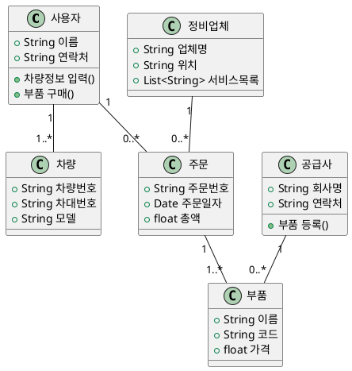

```plantuml
@startuml
    class 사용자 {
        +String 이름
        +String 연락처
        +차량정보 입력()
        +부품 구매()
    }
    class 차량 {
        +String 차량번호
        +String 차대번호
        +String 모델
    }
    class 부품 {
        +String 이름
        +String 코드
        +float 가격
    }
    class 공급사 {
        +String 회사명
        +String 연락처
        +부품 등록()
    }
    class 정비업체 {
        +String 업체명
        +String 위치
        +List<String> 서비스목록
    }
    class 주문 {
        +String 주문번호
        +Date 주문일자
        +float 총액
    }

    사용자 "1" -- "1..*" 차량
    사용자 "1" -- "0..*" 주문
    주문 "1" -- "1..*" 부품
    공급사 "1" -- "0..*" 부품
    정비업체 "1" -- "0..*" 주문
@enduml
```