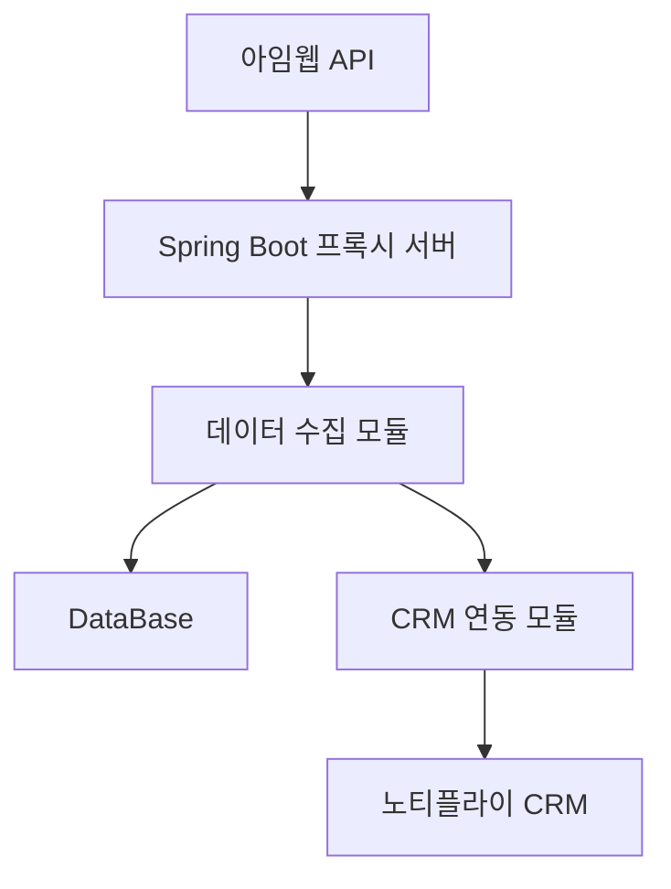

제안서 수정: 히어리 고객 정보 연동 프록시 서버 구축 프로젝트

1. 개요 (수정)
    노티플라이의 알림톡과 친구톡 기능을 효과적으로 활용하기 위해 고객 정보 연동이 필요한 상황입니다. 본 프로젝트는 14일 동안 아임웹 API를 활용한 기본적인 프록시 서버를 구축하고, 고객 정보를 CRM 시스템과 연동하는 것을 목표로 합니다.

2. 프로젝트 목표 및 범위 (수정)
   - 아임웹 API 접근을 위한 기본적인 프록시 서버 구축
   - 고객 정보의 기본적인 수집 및 CRM 시스템으로의 전송 구현

3. 제안 솔루션 (수정)
   a. 기술 아키텍처 개요
      - 프록시 서버: Spring Boot 프레임워크 사용
      - 데이터베이스: PostgreSQL
      - 배포 환경: 클라이언트 선호 클라우드 환경 (비용 별도 산정)
   
   b. 주요 기능 및 모듈
      - 아임웹 API 프록시 모듈 (기본 기능)
      - 고객 정보 수집 모듈 (기본 기능)
      - CRM 연동 모듈 (기본 기능)
   
   c. 솔루션의 장점
      - 빠른 구현: 핵심 기능에 집중하여 빠른 시일 내 기본 시스템 구축
      - 확장성: 향후 기능 확장을 고려한 기본 아키텍처 설계
      - 안정성: Spring Boot와 PostgreSQL의 안정적인 조합

4. 핵심 기능 상세 설명
   a. 아임웭 API 프록시
      - 기본적인 API 요청/응답 중개 기능 구현
   
   b. 고객 정보 수집
      - 아임웹으로부터 기본적인 고객 정보 수집 기능 구현
   
   c. CRM 연동
      - 수집된 고객 정보의 CRM 시스템 기본 전송 기능 구현

5. 시스템 아키텍처 및 다이어그램 

6. 프로젝트 수행 계획
   a. 요구사항 분석 및 설계 (2일)
   b. 프록시 서버 기본 개발 (1일)
   c. 데이터 수집 모듈 개발 (5일)
   d. CRM 연동 모듈 개발 (5일)
   e. 테스트 및 배포 (1일)

7. 일정 및 마일스톤 (수정)
   - 프로젝트 시작: D-day
   - 요구사항 분석 완료: D+2
   - 프록시 서버 개발 완료: D+7
   - 모듈 개발 완료: D+13
   - 최종 배포: D+14

9. 비용 견적
   - 총 프로젝트 비용: 2,000,000원 (VAT 별도)
   - 지불 조건: 계약금 40% (1,000,000원), 중간 결제 30% (750,000원), 최종 결제 30% (750,000원)

10. 예상 이슈 및 대응 방안
    - 이슈: 짧은 개발 기간으로 인한 기능 구현의 제한
      대응: 핵심 기능에 집중하고, 추가 기능은 향후 업데이트 계획 수립
    - 이슈: 요구사항 변경 가능성
      대응: 명확한 초기 요구사항 정의 및 변경 시 즉각적인 협의 진행
    - 이슈: "전화번호부" 에 대한 명확한 정의 필요 
      대응: 고객의 전화번호 하나인지 고객이 보유한 전화번호부를 조회 해야 하는건지 고객의 논의 필요

11. 결론 및 제안 요약 (수정)
    본 프로젝트를 통해 14일 이내에 기본적인 고객 정보 연동 시스템을 구축할 수 있습니다. 제한된 시간과 예산 내에서 핵심 기능을 구현하여, 향후 확장 가능한 기반을 마련할 것입니다.