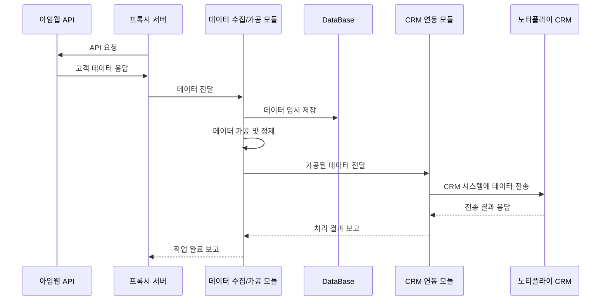

```mermaid
sequenceDiagram
    participant A as 아임웹 API
    participant B as 프록시 서버
    participant C as 데이터 수집/가공 모듈
    participant D as DataBase
    participant E as CRM 연동 모듈
    participant F as 노티플라이 CRM

    B->>A: API 요청
    A->>B: 고객 데이터 응답
    B->>C: 데이터 전달
    C->>D: 데이터 임시 저장
    C->>C: 데이터 가공 및 정제
    C->>E: 가공된 데이터 전달
    E->>F: CRM 시스템에 데이터 전송
    F-->>E: 전송 결과 응답
    E-->>C: 처리 결과 보고
    C-->>B: 작업 완료 보고
```