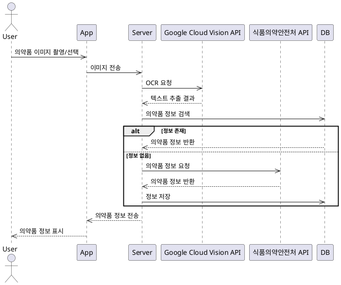

```plantuml
@startuml
    actor User
    participant App
    participant Server
    participant OCR as "Google Cloud Vision API"
    participant ExternalAPI as "식품의약안전처 API"
    participant DB
    User->>App: 의약품 이미지 촬영/선택
    App->>Server: 이미지 전송
    Server->>OCR: OCR 요청
    OCR-->>Server: 텍스트 추출 결과
    Server->>DB: 의약품 정보 검색
    alt 정보 존재
        DB-->>Server: 의약품 정보 반환
    else 정보 없음
        Server->>ExternalAPI: 의약품 정보 요청
        ExternalAPI-->>Server: 의약품 정보 반환
        Server->>DB: 정보 저장
    end
    Server-->>App: 의약품 정보 전송
    App-->>User: 의약품 정보 표시
@enduml
```